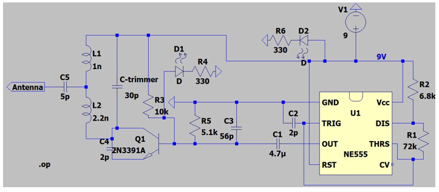

# Signal-Jammer
Visas signālu bloķētāju shēmas parasti sastāv no trīs “apakšķēdēm”: frekvences pastiprinātāja, frekvences regulētāja un sprieguma kontroles ķēdes . Šajā shēmā pastiprinātāja daļa sastāv no tranzistora Q1 un kondensatoriem C4 un C5, kurus izmanto, lai pastiprinātu signālu, kas plūst no regulējošās ķēdes.
The signal jammer circuit usually consists of three "sub-circuits": a frequency amplifier, a frequency regulator, and a voltage control circuit. In this circuit, the amplifier section consists of transistor Q1 and capacitors C4 and C5, which are used to amplify the signal flowing from the regulating circuit. The frequency regulating circuit section consists of a variable capacitor and two coils - L1 and L2. This creates a circuit that functions as a filter. Considering that the shared frequency range is 2400-2483.5 MHz, it is necessary to adjust the antenna component so that the frequency can be regulated as a result of experimentation. To regulate the frequency, a variable capacitor is chosen.
# LT Spice simulācija

# Schematic of the circuit

# Finished circuit

# Components

# 3D image

